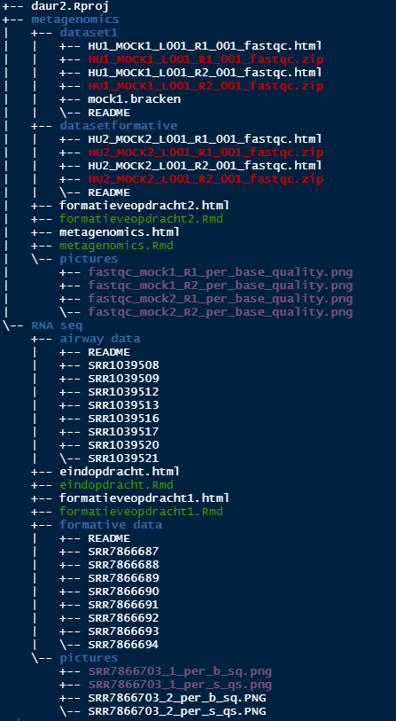

# Guerilla analytics

```{r, include=FALSE}
knitr::opts_chunk$set(echo = TRUE)
```

An important part of having a project repository is to keep it easily accesible and clean. This will allow anyone who uses the repository to be able to easily find their way around the files and data. The data structure in the repository used for this portfolio is based on the Guerilla Analytics Principle.


An example of this van be found below:


```{r}
#create a tree for the DAUR2 structure

```