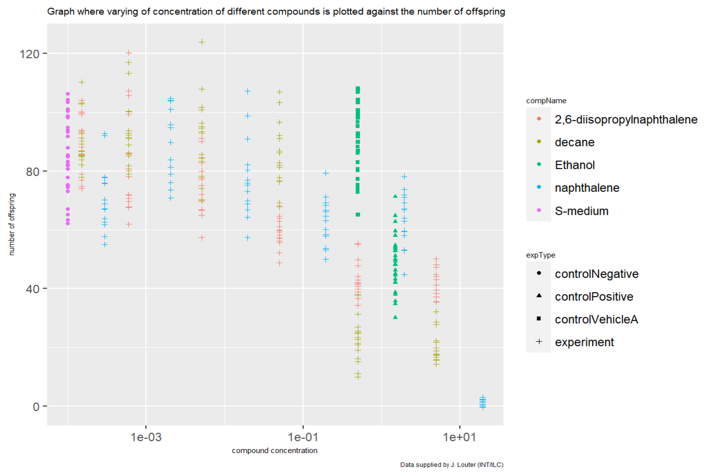

# Introduction
<!DOCTYPE HTML>
<html>
	<head>
		<title>Portfolio</title>
		<meta charset="utf-8" />
		<meta name="viewport" content="width=device-width, initial-scale=1, user-scalable=no" />
		<link rel="stylesheet" href="assets/css/main.css" />
		<noscript><link rel="stylesheet" href="assets/css/noscript.css" /></noscript>
	</head>
	<body class="is-preload">

		<!-- Wrapper -->
			

				<!-- Intro -->
					

						<h1>My portfolio 
						
A showcase of my projects and abilities in the field of data sciences

						<ul class="actions">
							<li><a href="#header" class="button icon solid solo fa-arrow-down scrolly">Continue</a></li>
						</ul>
					

				<!-- Header -->
					<header id="header">
						<a href="index.html" class="logo">About me</a>
					</header>

				<!-- Nav -->
					<nav id="nav">
						<ul class="links">
							<li class="active"><a href="index.html">Portfolio</a></li>
							<li><a href="generic.html">Open science</a></li>
						</ul>
						<ul class="icons">
							<li><a href="https://www.linkedin.com/in/timo-voskuilen-aa5728174/" class="icon brands fa-linkedin">Instagram</a></li>
							<li><a href="https://github.com/TimoVoskuilen" class="icon brands fa-github">GitHub</a></li>
						</ul>
					</nav>

				<!-- Main -->
					

						<!-- Featured Post -->
							<article class="post featured">
								<header class="major">
									June 12, 2022
									<h2><a href="#">Hi and welcome, 
									I am Timo Voskuilen</a></h2>
									
I am a 22 year old life sciences student at the university of applied sciences at the Hogeschool Utrecht. I am specified in biomedical research and thrive to find a career in the field of oncology. I am currently in the process of becoming a data scientist, I am following a course called Data science for biology at the Hogeschool Utrecht, where im learning do statistical analysis with bash and R.

								</header>
								
								<ul class="actions special">
									<li><a href="#" class="button large">Portfolio</a></li>
								</ul>
							</article>

						<!-- Posts -->
							<section class="posts">
								<article>
									<header>
										<h2><a href="_book/1-c.elegans-experiment.html">Data 
										Visualization</a></h2>
									</header>
									
									
Here I show my capability of making complex data visuable to the common reader.

									<ul class="actions special">
										<li><a href="_book/1-c.elegans-experiment.html" class="button">See for yourself</a></li>
									</ul>
								</article>
								<article>
									<header>
										<h2><a href="_book/1-c.elegans-experiment.html">reproducible 
										research</a></h2>
									</header>
									
									
Reproducibility means that research data and code are made available so that others are able to reach the same results as claimed in scientific outputs.

									<ul class="actions special">
										<li><a href="_book/1-c.elegans-experiment.html" class="button">See for yourself</a></li>
									</ul>
								</article>
								<article>
									<header>
										<h2><a href="_book/2-guerilla-analytics.html"> structural Data 
										       management</a></h2>
									</header>
									
									
Here I will show you my ability to keep an organized folder structure following the Guerilla protocol			 

									<ul class="actions special">
										<li><a href="_book/2-guerilla-analytics.html" class="button">See for yourself</a></li>
									</ul>
								</article>
								<article>
									<header>
										<h2><a href="_book/3-cv.html">my Curriculum 
										vitae</a></h2>
									</header>
									
									
Click for my Curriculum vitae.

									<ul class="actions special">
										<li><a href="_book/3-cv.html" class="button">See for yourself</a></li>
									</ul>
								</article>
								<article>
									<header>
										<h2><a href="_book/4-looking-ahead.html">Looking 
										in to the future</a></h2>
									</header>
									
									

									<ul class="actions special">
										<li><a href="_book/4-looking-ahead.html" class="button">See for yourself</a></li>
									</ul>
								</article>
								<article>
									<header>
										<h2><a href="_book/5-relational-databases.html">relational 
										databases</a></h2>
									</header>
									
									

									<ul class="actions special">
										<li><a href="_book/5-relational-databases.html" class="button">See for yourself</a></li>
									</ul>
								</article>
								<article>
									<header>
										<h2><a href="_book/2-guerilla-analytics.html">Creating my 
										own R package</a></h2>
									</header>
									
									

									<ul class="actions special">
										<li><a href="_book/2-guerilla-analytics.html" class="button">See for yourself</a></li>
									</ul>
								</article>
							</article>
							<article>
								<header>
									<h2><a href="_book/2-guerilla-analytics.html">ECDC 
									Covid analysis</a></h2>
								</header>
								
								

								<ul class="actions special">
									<li><a href="_book/2-guerilla-analytics.html" class="button">See for yourself</a></li>
								</ul>
							</article>
							</section>

						<!-- Footer -->
							<footer>
								

									<!--<a href="#" class="previous">Prev</a>-->
									<a href="#" class="page active">1</a>
								

							</footer>

					

				<!-- Footer -->
					<footer id="footer">
						<section>
							<form method="post" action="#">
								

									

										<label for="name">Name</label>
										<input type="text" name="name" id="name" />
									

									

										<label for="email">Email</label>
										<input type="text" name="email" id="email" />
									

									

										<label for="message">Message</label>
										<textarea name="message" id="message" rows="3"></textarea>
									

								

								<ul class="actions">
									<li><input type="submit" value="Send Message" /></li>
								</ul>
							</form>
						</section>
						<section class="split contact">
							<section>
								<h3>Email</h3>
								
<a href="#">timo.voskuilen@student.hu.nl</a>

							</section>
							<section>
								<h3>Social</h3>
								<ul class="icons alt">
									<li><a href="https://www.linkedin.com/in/timo-voskuilen-aa5728174/" class="icon brands fa-linkedin">Instagram</a></li>
									<li><a href="https://github.com/TimoVoskuilen" class="icon brands fa-github">GitHub</a></li>
								</ul>
							</section>
						</section>
					</footer>

			

		<!-- Scripts -->
			
			
			
			
			
			
			

	</body>
</html>